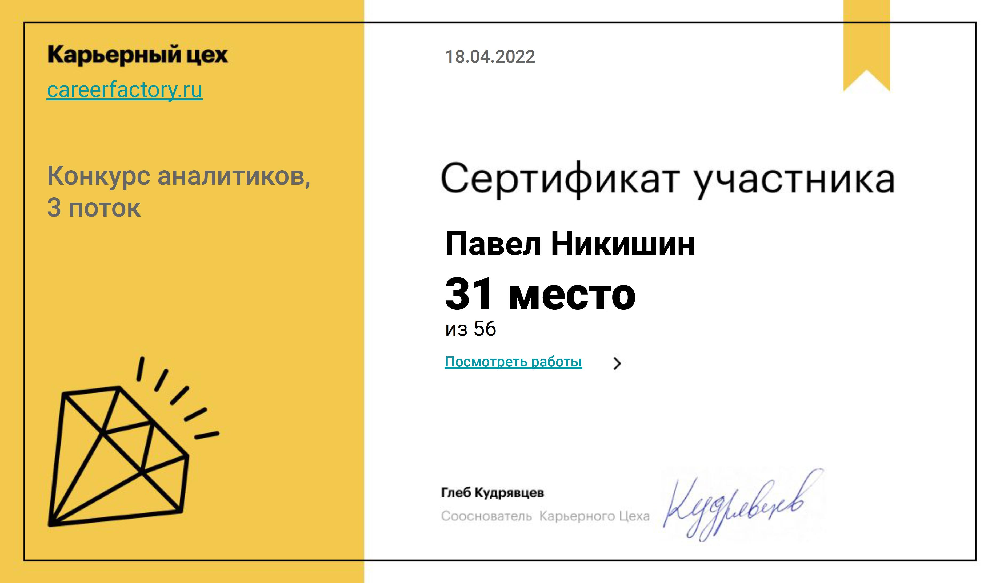

# CareerFactory22

[My solution](Task1.pdf) and [working notebook](sales_report_in_telegram.ipynb) to task 1 at the CareerFactory  competition in spring 22. In the competition, I was only interested in this one task. The resulting place in the ranking despite the fact that I passed only one task out of three.

  

[Link](https://contest.careerfactory.ru/personal_page/Y2nUTqkavFiHgWZSaMgz) to the solution  on contest site